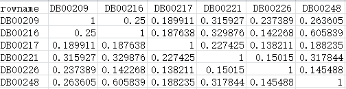
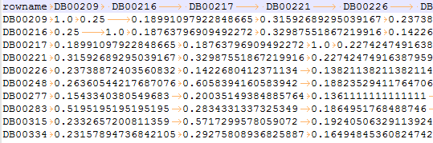
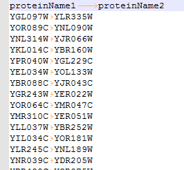
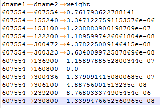
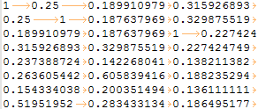
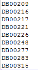

# 生物模块开发相关规范

关键词：问题  数据  方法  模块  结果


[TOC]

### 一. 数据规范

#### I. 数据类型

1. __文本__
    __网络关系__
    网络分两种：
    (1). 某一实体自身的网络， 比如蛋白质相互作用网络；

    (2). 两种实体之间的关系网络，比如疾病-基因关系网络。

    __其他如序列等__

2. __图像等__


#### II. 表现形式

1. __网络数据的表现形式__

    (1). __matrix__

       

       
       
    
    (2). __triplet__

       
       
       
       

2. __其它__

#### III. 数据格式规范

1. __分隔符__
    三种分隔符：***','		' '		'\t'***，考虑到数据的内容，逗号、空格作为分隔符都不合适，所以规定：

    > 所有输入输出文件均为文本文件，文本内容用***制表符 ( '\t' )*** 分隔。

2. __网络关系数据的表头（行名和列名）__
    
    规范1：
    > 所有triplet型的数据都必须有列名。

    规范2：
    > 矩阵的行和列须按行名和列名的字典序来排序；
    > 矩阵数据原则上要有行名和列名(见示例(1))。
    
    规范3：
    > 包括但不限于matlab语言，行名列名可单独列出，矩阵数据可只包含矩阵元素(见示例(2))。
    
    示例
    > (1)
    
    > 
    
    > (2)
    
    >      

#### IV. 数据描述规范

> 数据要有规范化的描述：类型，版本，日期，统计，来源/网址，参考文献等；
> 提供的数据要有意义；

### 二. 模块规范

#### I. 模块代码规范

所有模块都是可以有多个输出的，因此每个模块的输出都要用dict封装起来。

1. Java

    要求：
    > a. 每个模块只包含一个文件，文件类型必须是.java文件且文件名与文件所包含类名必须保持一致；
    > 
    > b. 模块中需包含execute方法（类似于main方法）；
    > 
    > c. execute() 上下文输入对象类型是InputStream；
    > 
    > d. execute() 的属性参数都是字符串类型，如需转换请在模块内转换成其它类型（如int）；
    > 
    > e. 上下文输入对象如果是triplet型文件，需加属性参数标明要读的某几列的列数；
    > 
    > f. execute() 输出对象类型是 Map<String, String> 类型，例子：<’output1’, ‘this is a string’>；
    
    demo：
``` java

import java.io.BufferedReader;
import java.io.IOException;
import java.io.InputStream;
import java.io.InputStreamReader;
import java.util.ArrayList;
import java.util.Collections;
import java.util.Comparator;
import java.util.HashMap;
import java.util.List;
import java.util.Map;
import java.util.Map.Entry;
import java.util.Vector;

public class MNC {
  
  public List<String[]> net;
  public List<String> nodes;
  public int[][] adjMatrix;
  
  /**
   * 调用方法并返回计算结果
   * @param input 输入数据，带列标题的网络数据
   * @param selectedColumn1 选择一列作为边的一个顶点
   * @param selectedColumn2 选择一列作为边的另一个顶点
   * @return
   */
  public Map<String, String> execute(InputStream input, String selectedColumn1, 
      String selectedColumn2){
    
    net = new ArrayList<>();
    int column1 = Integer.parseInt(selectedColumn1);
    int column2 = Integer.parseInt(selectedColumn2);
    //处理输入数据
    String networkStr = convertStreamToString(input);
    String[] networkArr = networkStr.split("\n");
    //第一行标识列标题，舍去
    for (int i = 1; i < networkArr.length; i++) {
      String[] edgeStr = networkArr[i].split("\t");
      net.add(new String[]{edgeStr[column1-1],edgeStr[column2-1]});
    }
    System.out.println("net size:"+net.size());
    //获取网络中的所有节点
    nodes = getAllNodes();
    //构建邻接矩阵
    adjMatrix = getAdjMatrix();
    
    //得到计算结果并对结果排序
    HashMap<String, Double> resMap = getResult();
    List<Entry<String, Double>> resList = new ArrayList<>(resMap.entrySet());
    Collections.sort(resList, new Comparator<Entry<String, Double>>() {
      @Override
      public int compare(Entry<String, Double> o1, Entry<String, Double> o2) {
        return o2.getValue().compareTo(o1.getValue());
      }
    });
    
    //将计算结果保存成字符串形式
    StringBuilder resStr = new StringBuilder();
    resStr.append("proteinName\tscore\n");
    for (Entry<String, Double> entry : resList) {
      resStr.append(entry.getKey()+"\t"+entry.getValue()+"\n");
    }
    
    Map<String, String> map = new HashMap<>();
    map.put("output", resStr.toString());
    
    return map;
  }
  

  /**
   * 从输入流中读取字符串进行解析
   * @param input
   * @return
   */
  public String convertStreamToString(InputStream input){
    
    BufferedReader br = new BufferedReader(new InputStreamReader(input));
    StringBuilder sb = new StringBuilder();
    
    String line = null;
    try {
      while ((line = br.readLine())!=null) {
        sb.append(line+"\n");
      }
    } catch (IOException e) {
      e.printStackTrace();
    }finally {
      try {
        input.close();
      } catch (IOException e) {
        e.printStackTrace();
      }
    }
    
    return sb.toString();
  }
  public HashMap<String, Double> getResult(){
    
    HashMap<String, Double> map = new HashMap<>();
    for (int i = 0; i < nodes.size(); i++) {
      double result = 0;
      //节点i的邻居节点
      List<Integer> neighbors = new ArrayList<>();
      for (int j = 0; j < nodes.size(); j++) {
        if (adjMatrix[i][j] != 0) {
          neighbors.add(j);
        }
      }
      if (neighbors.size()>0) {
        //由邻居节点构成的子图
        int[][] subAdm = new int[neighbors.size()][neighbors.size()];
        subgraph(subAdm, neighbors);
        //求子图的最大连通分量
        ConnectedCompent cc = new ConnectedCompent(subAdm);
        result = (double) cc.getMaxCCVertex();
      }
      map.put(nodes.get(i), result);
    }
    
    return map;
  }
  
  /**
   * 由邻居节点构成的网络的邻接矩阵
   * @param subAdm
   * @param neighbors
   */
  private void subgraph(int[][] subAdm, List<Integer> neighbors) {
    
    for (int i = 0; i < neighbors.size(); i++) {
      for (int j = i+1; j < neighbors.size(); j++) {
        if (adjMatrix[neighbors.get(i)][neighbors.get(j)] != 0) {
          subAdm[i][j] = 1;
          subAdm[j][i] = 1;
        }
      }
    }
  }
  
  /**
   * 获取网络的邻接矩阵
   * @return
   */
  private int[][] getAdjMatrix(){
    int len = nodes.size();
    int[][] adj = new int[len][len];
    
    int m,n;
    for (String[] edge:net) {
      for (m = 0; m < len; m++) {
        if (nodes.get(m).equals(edge[0])) {
          break;
        }
      }
      for (n = 0; n < len; n++) {
        if (nodes.get(n).equals(edge[1])) {
          break;
        }
      }
      if (n<len && m < len) {
        adj[n][m] = 1;
        adj[m][n] = 1;
      }else {
        System.out.println("array error!");
      }
    }
    return adj;
  }
  
   /* 从网络中获取所有的蛋白质节点
   * @return
   */
  private List<String> getAllNodes() {
    List<String> list = new ArrayList<>();
    
    for (String[] arr:net) {
      if (!list.contains(arr[0])) {
        list.add(arr[0]);
      }
      if (!list.contains(arr[1])) {
        list.add(arr[1]);
      }
    }
    System.out.println("node size:"+list.size());
    return list;
  }
  public class ConnectedCompent {
    /**
     * edge:二维数组，存储节点之间边的信息的列表
     */
    public int[][] edge;
    /**
     * visited:布尔数组，标记当前节点是否已经访问过
     */
    public boolean[] visited;
    /**
     * 当前进行深度优先遍历的连通图顶点集合
     */
    public List<Integer> cc;
    /**
     * 存放所有的连通分量
     */
    public Vector<List<Integer>> ccAll;
    /**
     * 最大连通分量索引位置
     */
    public int maxLoc;

    public ConnectedCompent(int[][] edge) {
      this.edge = edge;
      con();
    }

    /**
     * 求该图的连通分量
     */
    private void con() {
      maxLoc = 0;
      ccAll = new Vector<>();
      visited = new boolean[edge.length];

      for (int i = 0; i < edge.length; i++) {
        if (!visited[i]) {
          cc = new ArrayList<>();
          dfs(i);
          ccAll.add(cc);
          if (ccAll.get(maxLoc).size() < cc.size()) {
            maxLoc = ccAll.size()-1;
          }
        }
      }
    }
    
    /**
     * 获取连通分量的个数
     */
    public int getCCNum(){
       return ccAll.size();
    }

    /**
     * 图的深度优先递归算法
     */
    private void dfs(int i) {
      visited[i] = true;
      cc.add(i);
      for (int j = 0; j < edge.length; j++) {
        if (visited[j] == false && edge[i][j] == 1) {
          dfs(j);
        }
      }
    }

    /**
     * 最大连通分量的顶点数量
     */
    public int getMaxCCVertex(){
      
      return ccAll.get(maxLoc).size();
    }
    /**
     * 最大连通分量的边的数量
     */
    public int getMaxCCEdge(){
      
      int num = 0;
      List<Integer> maxCC = ccAll.get(maxLoc);
      for (int i = 0; i < maxCC.size(); i++) {
        for (int j = i+1; j < maxCC.size(); j++) {
          if (edge[i][j] != 0) {
            num = num + 1;
          }
        }
      }
      
      return num;
    }
  }

}
``` 

2. Python

    要求：
    > a. 每个模块只包含一个文件，而且文件类型必须是.py文件，建议用python3.x语法;
    > 
    > b. 需注意属性参数都是字符串类型；
    > 
    > c. 上下文输入对象如果是triplet型文件，需加属性参数标明要读的某几列的列数；
    > 
    > d. 每个模块都有一个/多个输出参数，指明结果写入文件的地址；
    > 
    > e. 结果存成dict类型，转成json格式之后，写入文件；
    
    demo:
```python
import json
import sys

def main():
    
    # 从文件读输入数据
    input1 = sys.argv[1]
    inputcontent = ''
    with open(input1, mode='r') as rf:
        for line in rf:
          inputcontent += line.strip() + '\n'

    # ---算法--
    # your algorithm
    # ---------

    # 输出
    result = inputcontent
    writefile = sys.argv[2]
    with open(writefile, mode='w') as wf:
        wf.write(result)

    data = {
      "output" : writefile,
    }
    json_data = json.dumps(data)
    print(json_data)


if __name__ == "__main__":
    main()
```

3. Matlab

    要求：
    > a. 每个模块只包含一个文件，而且文件类型必须是.m文件;
    > 
    > b. 需注意属性参数都是字符串类型；
    > 
    > c. 每个模块都有一个/多个输出参数，指明结果写入文件的地址；
    > 
    > d. 结果存入文件；
    > 
    > e. 输出文件地址保存在dict类型中，用disp()打印出来；
    
    demo:
```matlab
function ksim = knn_sim(osim_filename, k, outputfile)
    % 获取输入数据
    sim = load(osim_filename);
    
    % 算法
    [nrow, ncol] = size(sim);
    % diag(sim) = 0;
    diagsim = sim(logical(eye(size(sim))));
    sim(logical(eye(size(sim)))) = 0.0;
    [B, IX] = sort(sim, 2, 'descend');
    ksim = zeros(nrow, ncol);
    k = str2num(k);
    for i = 1:nrow
        for j = 1:k
            real_col = IX(i, j);
            ksim(i, real_col) = sim(i, real_col);
            ksim(real_col, i) = ksim(i, real_col);
        end
        for j = (k+1):ncol
            if B(i, j) == B(i, k)
                real_col = IX(i, j);
                ksim(i, real_col) = sim(i, real_col);
                ksim(real_col, i) = ksim(i, real_col);
            else
                break;
            end
        end
    end
    sim(logical(eye(size(sim)))) = diagsim;
    ksim(logical(eye(size(ksim)))) = diagsim;
    
    % 输出
    dlmwrite(outputfile, ksim, '\t');
    disp(['{output: "', outputfile, '"}']);
end
```

4. R

    要求：
    > a. 
    > b. 
    
    demo:
```R
# R code
```

5. 

#### II. 模块文档规范

  模块文档需包括以下10个部分：
  > 1.	编号
  > 2.	开发语言
  > 3.	提交时间
  > 4.	功能
  > 5.	使用方法
  > 6.	输入和参数说明
  > 7.	输出结果格式
  > 8.	参考文献/来源
  > 9.	开发人员
  > 10.	备注

### 三. 方法文档规范

  一个方法对应一篇具体文章，一般由多个模块组成。

  一个方法的文档包括以下部分：
  > 1.	类型
  > 2.	描述
  > 3.	输入
  > 4.	输出
  > 5.	模块，包括模块上下文参数，属性参数（给出具体的值），模块输出，模块先后顺序
  > 6.	测试和评价， 包括文章用到的具体数据和具体的评价方法
  > 7.	参考文献/来源：包括参考文献、网址等
  > 8.  开发人员
  
  demo:
  > NBI 方法
  > 1.  类型：关系预测
  > 2.  描述：NBI推荐值计算，该方法用来计算推荐值矩阵，通过二分图中两部资源传递的方法来计算推荐值矩阵。通过二分图的一个顶点集合中的任意两个顶点的共邻信息来预测二分图中的未知的边。假设二分图中的两组顶点集合为A和B。
  > 3.  输入：A和B已知关联关系。
  > 4.  输出：A和B的推荐值矩阵。
  > 5.  模块：
  > a1：二分图邻接矩阵创建模块（15-33-10-001）
  > &nbsp;&nbsp;输入：A和B的二分图关联关系列表文件
  > &nbsp;&nbsp;输出：A和B的二分图邻接矩阵
  > b1：二分图顶点度计算模块（15-33-10-002）
  > &nbsp;&nbsp;输入：A和B的二分图邻接矩阵（来自a1）
  > &nbsp;&nbsp;输出：二分图邻接矩阵的行顶点度的向量
  > b2：二分图顶点度计算模块（15-33-10-002）
  > &nbsp;&nbsp;输入：A和B的二分图邻接矩阵（来自a1）
  > &nbsp;&nbsp;输出：二分图邻接矩阵的列顶点度的向量
  > c1：NBI推荐值计算模块（15-33-11-001）
  > &nbsp;&nbsp;输入：A和B的二分图邻接矩阵（来自a1），二分图邻接矩阵的列顶点度的向量（来自b2），二分图邻接矩阵的行顶点度的向量（来自b1）
  > &nbsp;&nbsp;输出：A和B的推荐值矩阵
  > 6.  测试和评价
  > 测试数据为mtis_list.txt, 评价方式为10-fold cross validation。
  > 7.  参考文献/来源：Zhou,T. et al. (2007) Bipartite network projection and personal recommendation. Phys. Rev. E Stat. Nonlin. Soft Matter Phys., 76, 046115.


### 四. 问题描述文档规范
  > 1. 问题的描述
  > 2. 问题需要用到的数据
  > 3. 问题现有的方法

